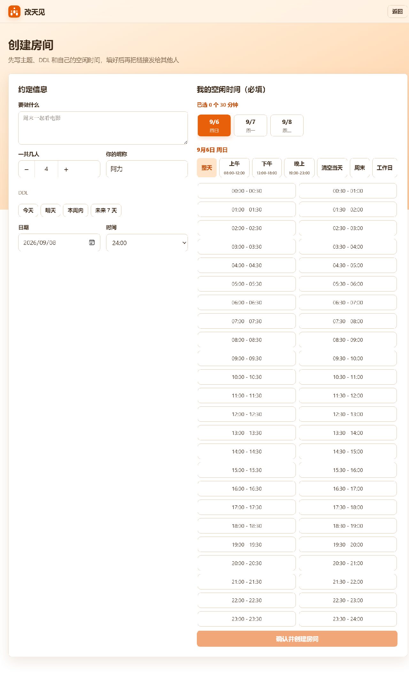
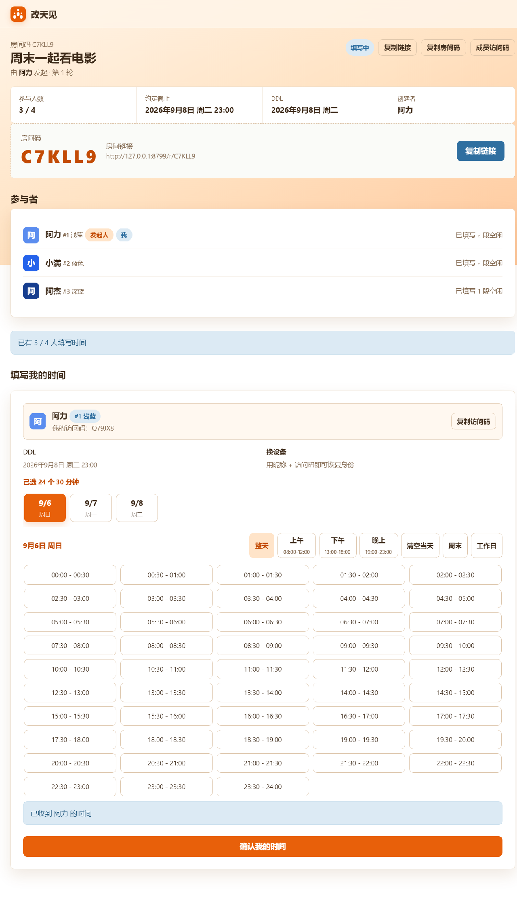

# 改天见

> 改天？哪一天？就这天！

一个帮你约成时间的多人约时间工具。发起人创建房间、设好 DDL，朋友用房间码或链接进来勾选自己的空闲时间；不只是计算共同空档，更会在“没有共同空档”时把局面谈成有空档。

## 和其他约时间工具的区别

大多数约时间工具只做一件事：找出重合空档。没有重合时，它们往往把长长的时段列表丢回给发起人，让你自己挨个找人协调。

改天见往前走了一步，把“找空档”变成完整闭环：

1. 没有全员重合时，自动选出“最多人能到”的时间段。
2. 协调页明确告诉发起人：现在差谁、谁需要调整。
3. 只有缺席成员需要回答“我可以调整”或“这个时段不行”。
4. 一个备选被排除后，自动进入下一个最多人可到的备选；全部都不行，才重新开始一轮约定。

它不是替你算出结果就结束，而是帮你把“没有空档”谈成“有空档”。

## 界面预览

| 首页 | 创建房间并选择空闲 | 成员与协调 |
| --- | --- | --- |
|  |  |  |

## 核心特点

- **30 分钟粒度日历**：先选日期再选时段，一格标注 `08:00-08:30`；支持上午 / 下午 / 晚上 / 整天 / 工作日 / 周末快捷选择，可再次点击取消。
- **DDL 截止机制**：发起人确定主题、人数与“截止到某日某时”，房间信息固定后其他人不能再改。
- **自动重合计算**：全员填完后自动列出共同空闲时间，一键确定并生成包含人数、主题、时间的备忘文案。
- **闭环协调**：没有全员重合时，自动优先展示最多人能到的时间，并只让缺席成员回答能否调整。
- **成员身份体系**：每位成员拥有固定颜色、编号与成员访问码，换设备也能恢复身份，避免同昵称误操作。
- **24 种成员色**：浅蓝、蓝色、深蓝……浅/中/深三档色系，一眼分清谁是谁。
- **再约一次**：时间确定后一键复制备忘，也可以马上创建下一轮。
- **零依赖轻量部署**：仅用 Python 标准库实现服务端，可本地运行，也可一键部署到 Railway。

## 在线体验

<https://gaitian-production.up.railway.app>

首次访问若稍慢，是 Railway 免费实例冷启动；随后刷新即可。

## 快速开始

```bash
python server.py
```

打开 `http://127.0.0.1:8765` 即可使用。房间数据保存在 `data/rooms.json`。

如需换端口或指定数据目录：

```bash
PORT=9000 python server.py
DATA_DIR=/var/data python server.py
```

## 云端部署

项目支持 Railway / Render 等平台：

- 启动命令：`python3 server.py`
- 平台端口：通过 `PORT` 环境变量注入
- 数据持久化：设置 `DATA_DIR` 指向持久卷
- 固定分享域名：设置 `PUBLIC_BASE_URL=https://你的域名`

## 技术栈

- 前端：原生 HTML / CSS / JavaScript，无框架依赖
- 后端：Python `http.server` + `ThreadingHTTPServer`
- 数据：JSON 文件存储

## License

MIT
